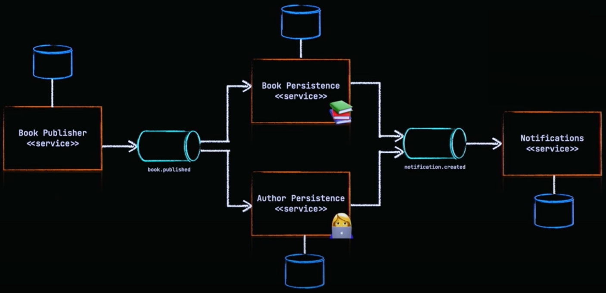

# Spring Boot With Kafka
Simple project to explore Kafka with Spring Boot

# Architecture

# Original Git repository
https://github.com/devtiro/microservices-kafka-tutorial

# Spring Initializr Initial Setup
https://start.spring.io/#!type=maven-project&language=java&platformVersion=3.4.2&packaging=jar&jvmVersion=17&groupId=com.wilterson.kafka&artifactId=kafka-notifications&name=Kafka%20Notifications&description=Exploring%20Kafka%20with%20Spring%20Boot&packageName=com.wilterson.kafka&dependencies=lombok,kafka,data-jpa,h2,web